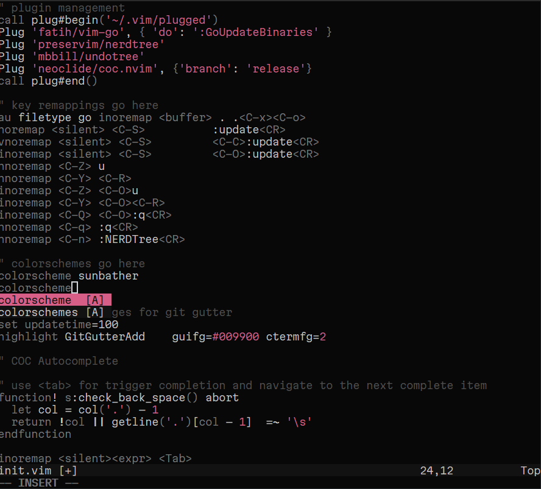

# 🍇 dotfiles

## powerlevel10k configuration:

[p10k.zsh](p10k.zsh)

## Windows Terminal configuration:

[settings.json](settings.json)

## Fonts:

- Hack NF (used in Windows Terminal)
- Hasklig (recommended for programming)
- Lilex (super-clean, easy-to-read)
- Fira Code (if you're not liking Lilex)

## VSCode Recommended Extensions:

- Remote WSL (Highly Recommended)
- Indent Rainbow
- Font Switcher

## VSCode Themes:

Soft:

- Soil (Recommended)
- SoftDark (Recommended)

Dark:

- Invictus
- BeardedBear Monokai Terra
- BeardedBear Blueberry

High Contrast:

- Ocean Space

Other:

- Solarized Custom
